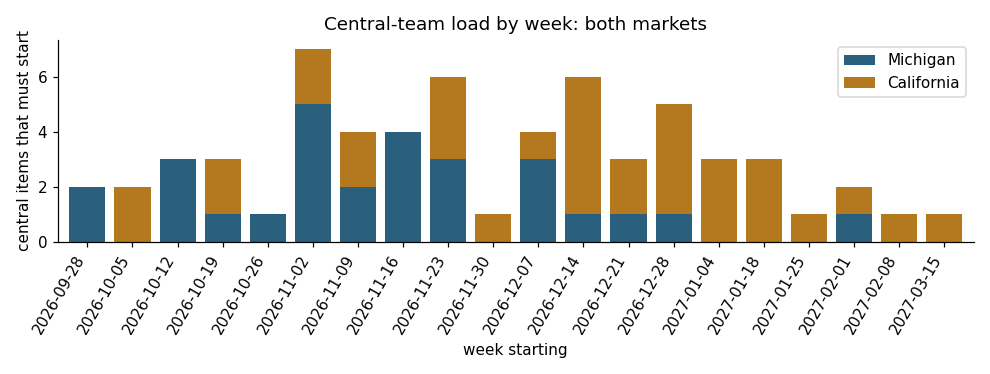

# Concurrent Launch Readiness Model

[](https://github.com/harshagarwal2412-cell/concurrent-launch-readiness-model/actions/workflows/ci.yml)

**Live demo:** https://harshagarwal2412-cell.github.io/concurrent-launch-readiness-model/

## Problem

Launching two healthcare markets at once isn't twice the work of launching one. Market-level hiring scales with each market. Central functions don't: Clinical Operations, Product, Learning & Development, Legal and Credentialing are the same people serving both launches.

Status decks show each launch's dates separately, so they hide the real question: **given the go-live dates, what should already have started, and which weeks ask the same central team for two things at once?**

## Solution

A lead-time model for launching in-home and virtual oncology care in two states at the same time (Michigan and California in the example).

- **52 readiness dependencies** across 8 workstreams (payer, licensure, staffing, training, platform, vendors, workflows, go-live), each with a lead time, duration and owner
- **Critical-path chart:** every item placed on the last date it can start, against today and both go-lives
- **Collision view:** the weeks where both markets need central-function work started
- **Readiness ledger:** status tracking per market, with overdue and at-risk flags
- **Learnings capture and JSON export**, so the third launch starts from a better template

Change a go-live date and every deadline, flag and collision recalculates.

## Architecture

```
src/
├── domain/                  # Pure TypeScript, no React: fully unit-tested
│   ├── types.ts             # Item, Plan, Status, Flag, MarketId
│   ├── data.ts              # 52 dependencies, 8 workstreams, 2 markets
│   ├── schedule.ts          # Latest-start math, flags, collision detection, scoreboard, export
│   └── schedule.test.ts     # Vitest suite
├── hooks/usePlan.ts         # Plan state persisted to localStorage
├── components/
│   ├── CriticalPath.tsx     # Lane chart, keyboard accessible
│   ├── Collisions.tsx       # Weekly central-team load, both markets
│   └── Ledger.tsx           # Per-market status ledger with focus/scroll on chart click
└── App.tsx
scripts/export-data.ts       # Exports the model to CSV for the analysis layer
analysis/                    # Python + SQL analysis (see below)
```

**Design decisions**

- **"Today" is injected, never read inside the engine.** Every function takes `today` as a parameter, which makes the date logic deterministic and testable at any point in time.
- **Deadlines are derived, never stored.** Latest start = go-live − lead time, so moving a launch date moves everything with it.
- **Week bucketing is Monday-aligned** in both the TypeScript engine and the SQL, and tests check that both agree.

## Data analysis (Python + SQL)

[`analysis/`](analysis/) rebuilds the model's scheduling logic as **SQL views**. It uses SQLite date functions for latest starts and Monday-aligned weeks, and a `CASE` for the flags. **pandas** and **matplotlib** handle the analysis. See [`analysis/report.ipynb`](analysis/report.ipynb) for the full analysis with charts.

- 6 SQL queries: overdue items, collision weeks, peak month per central function (window functions), and workstream readiness pivots
- pytest confirms the SQL produces the **same latest-start date and flag as the TypeScript engine for all 104 item-market pairs**



## Testing

**TypeScript (Vitest):** 16 tests cover:

- lead-time math, including post-go-live items
- risk-window boundaries (21 vs. 22 days)
- blocked/done precedence
- Monday week alignment
- collision counting and ranking
- scoreboard totals and export shape

**Python (pytest):** 9 tests cross-check the SQL against the engine.

```bash
npm install
npm test
npm run typecheck
npm run dev

pip install -r analysis/requirements.txt
pytest analysis
```

CI runs both suites on every push. `main` deploys to GitHub Pages.

## Tech stack

**Languages:** TypeScript · Python · SQL

React 18 · Vite · Vitest · pandas · matplotlib · SQLite · pytest · Jupyter · GitHub Actions · GitHub Pages

## Data

Generic readiness dependencies for launching in-home and virtual oncology care in a new state. No company data is included. Lead times are estimates, and the point of the model is to make them visible and open to debate.

---

Harsh Agarwal
